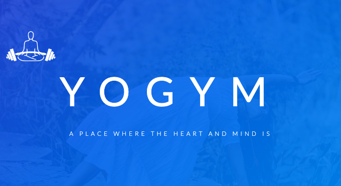

Table of Contents
=================

- [Table of Contents](#table-of-contents)
- [__YOGYM-Milestone 1st project__](#yogym-milestone-1st-project)
  - [__Description__](#description)
  - [__YOGYM responsive website__](#yogym-responsive-website)
  - [__User Experience goals__](#user-experience-goals)
    - [__First time user:__](#first-time-user)
    - [__Frequent user:__](#frequent-user)
    - [__Returning User:__](#returning-user)
  - [__Design__](#design)
    - [__color scheme__](#color-scheme)
    - [__Typography__](#typography)
    - [__imagery__](#imagery)
  - [__Structure__](#structure)
    - [Homepage](#homepage)
    - [Navigation Bar](#navigation-bar)
    - [About Section](#about-section)
    - [Features Section](#features-section)
    - [Plans Section](#plans-section)
    - [Stories Section](#stories-section)
    - [Contact Us Section](#contact-us-section)
  - [__Features__](#features)
    - [Current Feature](#current-feature)
    - [Future Implementations](#future-implementations)
    - [__Technologies Used__](#technologies-used)
    - [HTML](#html)
    - [CSS](#css)
    - [Google Fonts](#google-fonts)
    - [Visual Studio Code](#visual-studio-code)
    - [Techsini](#techsini)
    - [Github](#github)
    - [Github Pages](#github-pages)
  - [**__Testing__**](#testing)
  - [**Deployment**](#deployment)
    - [**Starting The Project**](#starting-the-project)
  - [**Deployment to cloud platform**](#deployment-to-cloud-platform)
  - [**Credits**](#credits)
    - [**Acknowledgements**](#acknowledgements)
    - [**Media And Rest**](#media-and-rest)

# __YOGYM-Milestone 1st project__
[this](#about)
## __Description__
This website in created for the first project of Code Institute's [Diploma in Full Stack Software Development](https://codeinstitute.net/ie/full-stack-software-development-diploma/). The criteria of used technologies was limited to only HTML and CSS therefore, it is only a static website.

You can have a Live view of website [here](https://shahbakhat.github.io/milestone-project-one/).

---
## __YOGYM responsive website__

As the important criteria of the project the site is fully responsive to different displays. All sections of the website  and font and heading and each and every content is user friendly as in responsiveness.
___

## __User Experience goals__
### __First time user:__
As a first time user the main idea of the platform is clear that what is the platform of this website trying to convey to the audience. The website navigates to the user through the whole section and fulfill the Psychological curiosity of the purpose behind this website
### __Frequent user:__
As a frequent user or who is already a member they can get to sign in by getting in touch with the Gym have them signed in online for newsletter, new offers , and for upcoming and ongoing event.
### __Returning User:__
A returning user can be satisfied with all they need to know about the gym and inquire for registration and can contact to the gym by filling up contact us form.

___

## __Design__
### __color scheme__
The whole website is colored in Vivid Blue #0d56d9 as a primary color and Pure Blue #009AFC as a secondary color. these color are used wisely as a having health and fitness platform theme, these two colors are cool on eyes and have a peaceful feeling in to them when user look at them, moreover, these colors are used by some commercial websites too so the used can be familiar or can relate by looking at them.
### __Typography__

all through the website the  __Lato__ font is used from Google fonts library.
### __imagery__
Not many images are used to keep the  website's performance healthy, just one hero image was used to make the first look of the home page attractive.
___
## __Structure__
The website is structured to let the user know all about the platform behind the website.
- The platform's identity 
- What they exactly are
- What features do they offer 
- How affordable they are 
-  What do their members think about them
-  And how a user can get in touch with them
____
### Homepage
___

Homepage has the Logo of the platform and the brand name they do identify as.
homepage has pure **CSS** animations created with *@keyframes* property, where logo slides from right to left and main heading slides from left to right to make it little entertaining and attractive to the user.
___
### Navigation Bar
___

___
The Navigation Bar navigates the user through the whole websites, all the buttons are active by clicking them and all relative sections are linked to the buttons accordingly.
### About Section
___

About sections has the details about the platform's Ideology and their Goals to inform well the user about them.
___
### Features Section
___

Features section give details as in what programs do they offer and what a user can get out of it as in benefits by signing up the __Yogym__
___
### Plans Section
___

Plans section gives the whole range of offers which a user can avail and the section has been created with beautiful attractive gradients to convey the very modern color scheme so the user can have an impact of modern technological modern Era. the plans cards have a different gradient *hover* effect to keep in interesting and entertaining.
____
### Stories Section
___

In story section , 2 of the signed up members share their stories that what they got out of signing up with **Yogym** and what makes it way different and *unique* than other platforms.
___
### Contact Us Section
___

And finally the Contact Us section gives the user ability to contact and inquire about signing up or any other queries regarding the plans and programs **Yogym** does offer. A user can fill up the form with their Full Name and E-Mail Address and then write their inquiry and Submit it.
___

## __Features__

### Current Feature
Right now there is no back-end on this website, it is just a static website and can not perform any action but only visual design is there. 
### Future Implementations
In Future i wish to put all the elements to actions which could have been done with some back-end source, in future the buttons on Plans cards can be the *Call To Action* buttons so the user can be directed towards sign-up section and sign-up and pay for the monthly or annual subscription, and there can be a sign-up form with created in the future.
___
### __Technologies Used__
____
### HTML
The Layouts of the websites are created and desIgned using HTML Markup computer language
### CSS
The website was styled by using custom CSS
### Google Fonts
*Lato* Fonts were used from Google Fonts library.

### Visual Studio Code

VS code was used as an IDE(*Integrated Development Environment*) to develop this website .

### Techsini
Techsini.com was used to create a mockup for multiple devices and mockup was generated for this README file.

### Github
Github was used to store all the source code for this website

### Github Pages
Using github pages this website was deployed online.
____
## **__Testing__**
___

To make sure everything is all in place and working testing was done on the whole website.
responsiveness was tested on all  devices using 
*Google Chrom Dev Tools* and *[amiresponsive.com](https://responsivedesignchecker.com/checker.php?url=https%3A%2F%2Fshahbakhat.github.io%2Fmilestone-project-one%2Findex.html&width=1400&height=700)* . All buttons were tested if they are properly linked to the relative link and accessibility test was done for visual effects. all the color contrasts were tested using [webaim.org](https://webaim.org/resources/contrastchecker/).
HTML was tested using W3C [HTML validator](https://validator.w3.org/).
To test CSS code the [Jigsaw](https://jigsaw.w3.org/css-validator/) was used.

| Tests  |      Expectations      | Pass/Fail |
|----------|:-------------:|------:|
|__Testing Responsiveness on Google Chrome__ |  Elements are not going out of the flow by decreasing the sizes for different screens and imagery is in right size and width ***____Steps:*** To open the developer console in Google Chrome, open the Chrome Menu in the upper-right-hand corner of the browser window and select More Tools > Developer Tools.You can also use Option + ⌘ + J (on macOS), or Shift + CTRL + J (on Windows/Linux)| **PASS** |
| __Testing Responsiveness on Mozilla Firefox__ |   Elements are not going out of the flow by decreasing the sizes for different screens and imagery is in right size and width.***_____Steps:*** To open the developer console in Firefox, click on the Firefox Menu in the upper-right-hand corner of the browser and select More Tools > Browser Console.You can also use the shortcut Shift + ⌘ + J (on macOS) or Shift + CTRL + J (on Windows/Linux).|   **PASS** |
| __Testing Responsiveness on Microsoft Edge__ | Elements are not going out of the flow by decreasing the sizes for different screens and imagery is in right size and  width.***_____Steps:*** To open the developer console in Microsoft Edge, open the Edge Menu in the upper-right-hand corner of the browser window and select More Tools > Developer Tools.You can also press CTRL + Shift + i to open it.|   **PASS** |
|  __Testing Navigation Buttons if they are linked to correct sections of the page__|By clicking home it reloads the website, About buttons brings to About section, Features Button brings to Features section, Plans button brings to Plans section, Contact Button brings to Contact Form section.   |   **PASS** |
| __Testing Hover effects on plans cards if they change colors when hover__ | By hovering the cursor each card does change the colors.  |    **PASS** |
| __Testing Hover effects on plans cards buttons if they change colors and are they linked to the contact section__ |    By hovering the cursor over the Buttons they change colors and by clicking them they bring the user to contact us section.   | **PASS** |
| __Testing All inputs are working and inquiry form is working too__| when user skip inputs then the inputs give **required** *WARNING* to fill the Full name and E-Mail inputs. |    **PASS** |
| __Testing the HTML code using  [W3C HTML validator](https://validator.w3.org/).__ |    There are no errors in HTML and Validator passes the [**Test**](https://validator.w3.org/nu/?doc=https%3A%2F%2Fshahbakhat.github.io%2Fmilestone-project-one%2F) |   **PASS** |
| __Testing CSS code with [Jigsaw](https://jigsaw.w3.org/css-validator/)__ | Jigsaw doesnt give errors during the [**Test**](https://jigsaw.w3.org/css-validator/validator?uri=https%3A%2F%2Fshahbakhat.github.io%2Fmilestone-project-one%2F&profile=css3svg&usermedium=all&warning=1&vextwarning=&lang=en) |    **PASS** |
___
## **Deployment**
___
### **Starting The Project**
The project was started and coded in VS code Editor and  Git Extension was used to commit and push all the changes to and sync them to the repository.
my Full Name and Email address was configured to all the branches not only to this project.
For Live server preview of the ongoing project VS codes built in ***Go Live*** option was used.
## **Deployment to cloud platform**
Github Pages were used to deploy the website by using following steps:
Make sure the branch you want to use as your publishing source already exists in your repository.

1) On GitHub, navigate to your site's repository.

2) Under your repository name, click  Settings.
Repository settings button

3) In the "Code and automation" section of the sidebar, click  Pages.

4) Under "Build and deployment", under "Source", select Deploy from a branch.

5) Under "Build and deployment", under "Branch", use the None or Branch drop-down menu and select a publishing source.

6) Drop-down menu to select a publishing source

7) Optionally, use the drop-down menu to select a folder for your publishing source.
Drop-down menu to select a folder for publishing source

8) **Click Save**.
___
## **Credits**
____
### **Acknowledgements**
First of All thanks to [Code Institute](https://codeinstitute.net/ie/) for an amazing content and brilliant course to offer, and then All thanks go to my Mentor ***"Ronan Mclelland"*** for helping me out through the project by showing the right path and to help me when i was overwhelmed few things, he proved to be a flawless mentor and an amazing person.
### **Media And Rest**
Photos were taken from [pexels.com](https://www.pexels.com/). Fonts were chosen from [Google fonts library](https://fonts.google.com/specimen/Lato). Color Pallets were taken from [Coolors.co](https://coolors.co/).
